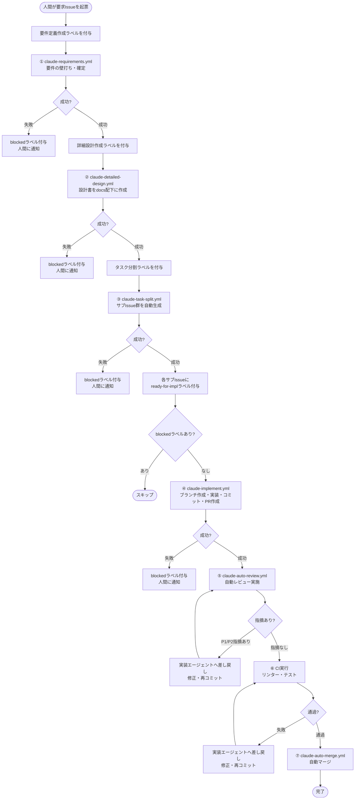

# ハーネスエンジニアリング実装設計書（MVP）
## Claude Code + GitHub Actions による AIエージェントチームの構築

## 1. コンセプト：ハーネスの整備
本設計では、モデル単体の性能に頼るのではなく、**「開発プロセスの細分化」と「GitHub上での可視化」**を軸とした、自己改善システムの構築を目指す。

---

## 2. 開発プロセスの分解
エージェントが各ステップを確実に完遂できるよう開発プロセスを以下の6段階に細分化する。

### 2.1 要求・要件定義
人間が起票した要求Issueに対し、エージェントが壁打ちを行いながら要件を明確化。

### 2.2 基本・詳細設計
要件に基づき、スキーマ定義やPR分割計画を含む設計ドキュメントを作成。

### 2.3 タスク分割
設計書に含まれるPR分割計画をもとに、実装用のサブIssue群を自動生成。

### 2.4 実装（(Claude Code)
Issueの指示に従い、ブランチ作成、実装、テスト実行、PR作成までを一貫して行う。

### 2.5 レビュー・修正
アーキテクチャや保守性の観点から自動レビューを行い、必要に応じて実装エージェントへ差し戻して修正ループを回す。

### 2.6 CI/CD・マージ
すべてのチェックを通過したコードを自動でマージし、継続的な開発フローを成立させる。

---

## 3. Issue起票からマージまでのフロー

---

## 4. エージェントチームの構成とフロー（目標）

GitHub Actionsを基盤とし、**「ラベル付与」をトリガーにしたバトンリレー方式**を採用する。

| フェーズ | 担当エージェント | トリガーと主な役割 |
|---|---|---|
| 開始 | 人間 | 要求Issueを起票し、「要件定義作成」ラベルを付与 |
| ① 要件定義 | `claude-requirements.yml` | Issue上で壁打ちを行い要件を確定。完了後、「詳細設計作成」ラベルを付与 |
| ② 詳細設計 | `claude-detailed-design.yml` | 設計書を `docs/` 配下に作成。完了後、「タスク分割」ラベルを付与 |
| ③ タスク分割 | `claude-task-split.yml` | 設計書から実装用サブIssue群を自動生成し、必要に応じて依存関係も設定 |
| ④ 実装 | `claude-implement.yml` | Claude Codeを用い、コード生成からテスト、PR作成までを完遂 |
| ⑤ レビュー | `claude-auto-review.yml` | 自動レビューを実施。指摘があれば実装エージェントへ戻し、修正ループを回す |
| ⑥ マージ | `claude-auto-merge.yml` | CI（リンター・テスト）通過後、自動でマージを実行 |

---

## 4. ハーネスの重要要件

エージェントが**ドリフト（終了条件の誤認や品質の自己過信）**を起こさないよう、以下のガードレールを実装する。

### 4.1 記録システムとしての `docs/` 管理
エージェントがアクセスできない外部情報（Slack等）は「存在しないもの」として扱い、要件・設計・判断根拠はすべてリポジトリ内の `docs/` に集約してバージョン管理する。

### 4.2 `CLAUDE.md` / `AGENTS.md` の最適化
百科事典のように情報を詰め込むのではなく、リポジトリ構造や重要な情報のみを示す**地図**として機能させる。エージェントの認知負荷を抑えつつ、適切な行動を促す設計とする。

### 4.3 決定論的なコード制約（リンター / CI）
アーキテクチャ上の制約や禁止事項は、人間の注意喚起ではなく、リンターやCIによって**機械的に強制**する。エラーメッセージに修復手順を含めることで、エージェントが自律的に修正できるフィードバックループを構築する。

### 4.4 ガベージコレクション（技術的負債の回収）
エージェント生成コードに起因する不均一さや技術的負債を定期的に検知し、リファクタリングするバックグラウンドタスクを運用する。

---

## 5. 実装に向けたガイドライン

### 5.1 エージェント中心の環境構築
リポジトリの初期構造やCI構成を含め、できる限りエージェント自身に生成・整備させることで、エージェントにとって最も認識しやすい環境を維持する。

### 5.2 可視化の徹底
進捗、判断、設計意図、レビュー結果はすべてGitHub Issue / PR上に集約し、人間が必要なタイミングで容易に介入・救済できるように設計する。

### 5.3 人間の役割
人間は初期要求の提示、重要な意思決定、例外時の救済に集中し、それ以外の反復的な作業は可能な限りエージェントへ委譲する。

---

## 6. このMVPの到達目標

本MVPの到達目標は、以下のサイクルを**人間の最小介入で安定運用できる状態**とすることである。

1. 人間が要求Issueを起票する
2. 要件定義・設計・タスク分割が自動で進む
3. Claude Codeが実装・テスト・PR作成を行う
4. 自動レビューが品質を担保する
5. CI通過後に自動マージされる

この一連の流れをハーネスとして整備することで、AIエージェントを継続的に価値を生む開発チームとして運用できる状態を目指す。
