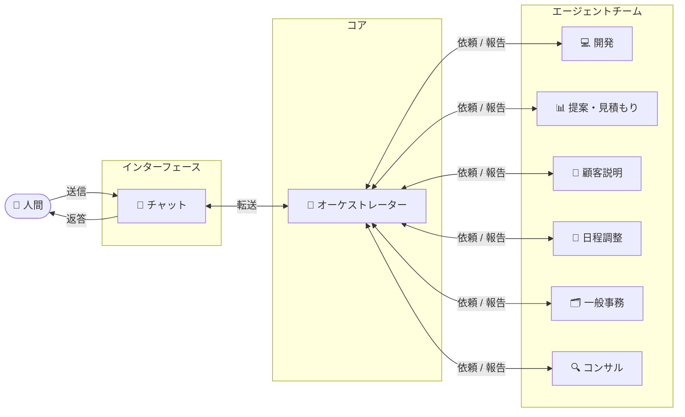

# システム全体構成図

```mermaid
flowchart LR
    Human(["👤 人間"])

    subgraph Interface["インターフェース"]
        Chat["💬 チャット"]
    end

    subgraph Core["コア"]
        Orch["🧠 オーケストレーター"]
    end

    subgraph Teams["エージェントチーム"]
        Dev["💻 開発"]
        Est["📊 提案・見積もり"]
        Pres["📢 顧客説明"]
        Sched["📅 日程調整"]
        Admin["🗂️ 一般事務"]
        Consult["🔍 コンサル"]
    end

    Human -->|送信| Chat
    Chat -->|返答| Human
    Chat <-->|転送| Orch
    Orch <-->|依頼 / 報告| Dev
    Orch <-->|依頼 / 報告| Est
    Orch <-->|依頼 / 報告| Pres
    Orch <-->|依頼 / 報告| Sched
    Orch <-->|依頼 / 報告| Admin
    Orch <-->|依頼 / 報告| Consult
```
