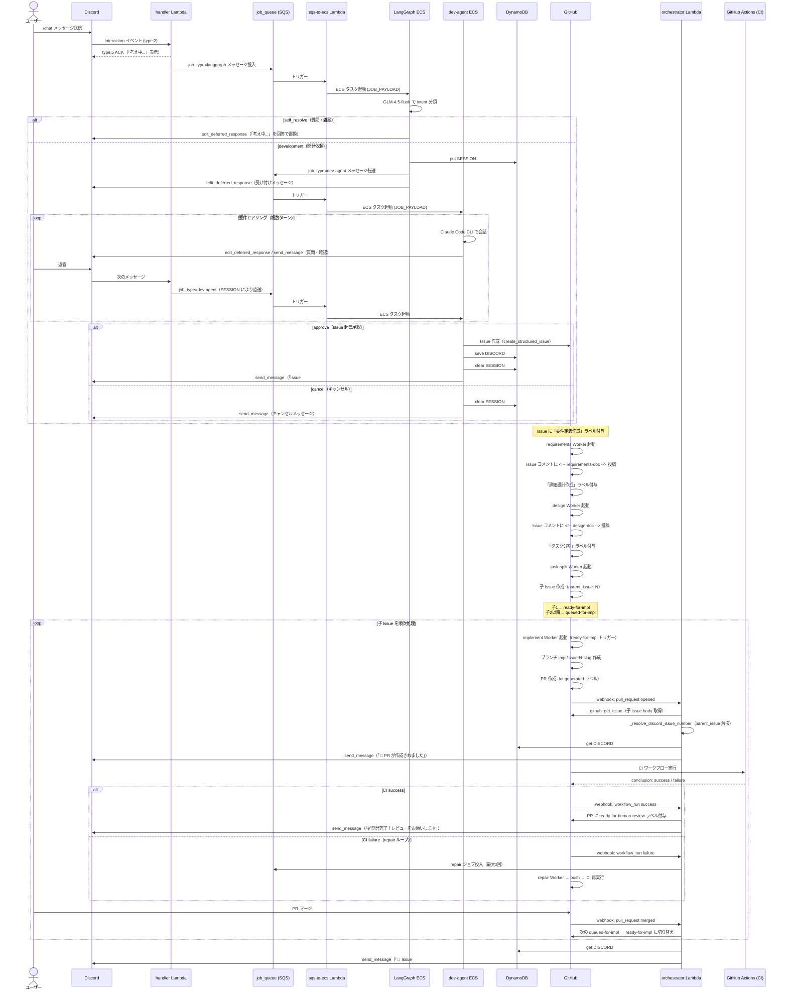

# Discord → PR通知 フロー図

## 主要コンポーネント対応表

| コンポーネント | 実体 |
|---|---|
| handler Lambda | `agent-intake` の Discord Interaction ハンドラー |
| LangGraph ECS | `src/langgraph/` — GLM-4.5-flash で intent 分類・ルーティング |
| dev-agent ECS | `src/dev-agent/` — Claude Code CLI で要件ヒアリング |
| sqs-to-ecs Lambda | `src/sqs_to_ecs/` — SQS → ECS RunTask |
| orchestrator Lambda | `src/orchestrator/` — GitHub Webhook 受信・Discord 通知 |
| Workers | `dev-agents` リポジトリの `.github/workflows/` + `agent-intake/src/worker/` |
| DynamoDB | STATE_TABLE — SESSION / THREAD / PENDING_ISSUE / DISCORD# |
