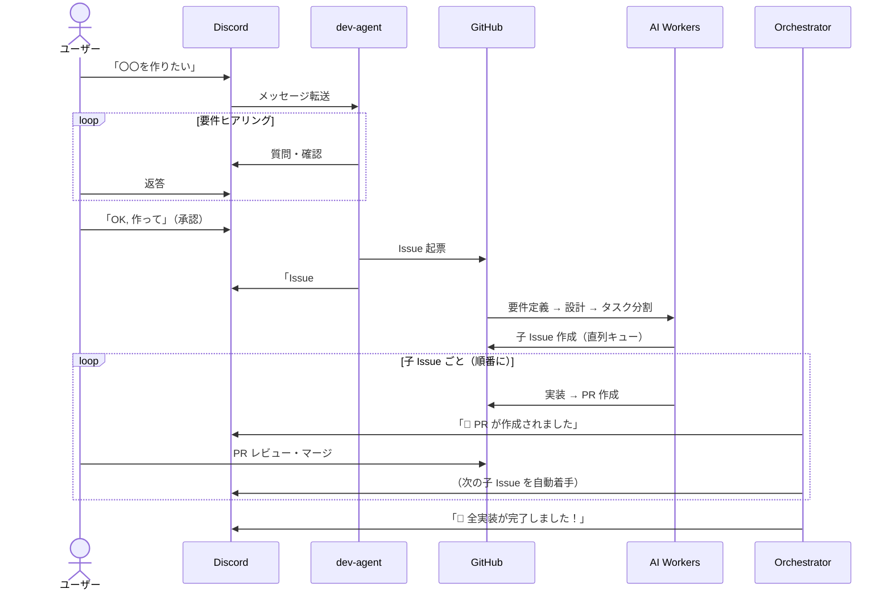

# フロー概要（簡易版）

```mermaid
sequenceDiagram
    actor User as ユーザー
    participant Discord
    participant DevAgent as dev-agent
    participant GitHub
    participant Workers as AI Workers
    participant Orchestrator as Orchestrator

    User->>Discord: 「〇〇を作りたい」
    Discord->>DevAgent: メッセージ転送

    loop 要件ヒアリング
        DevAgent->>Discord: 質問・確認
        User->>Discord: 返答
    end

    User->>Discord: 「OK, 作って」（承認）
    DevAgent->>GitHub: Issue 起票
    DevAgent->>Discord: 「Issue #N を起票しました」

    GitHub->>Workers: 要件定義 → 設計 → タスク分割
    Workers->>GitHub: 子 Issue 作成（直列キュー）

    loop 子 Issue ごと（順番に）
        Workers->>GitHub: 実装 → PR 作成
        Orchestrator->>Discord: 「🔧 PR が作成されました」
        User->>GitHub: PR レビュー・マージ
        Orchestrator->>Discord: （次の子 Issue を自動着手）
    end

    Orchestrator->>Discord: 「🎉 全実装が完了しました！」
```
